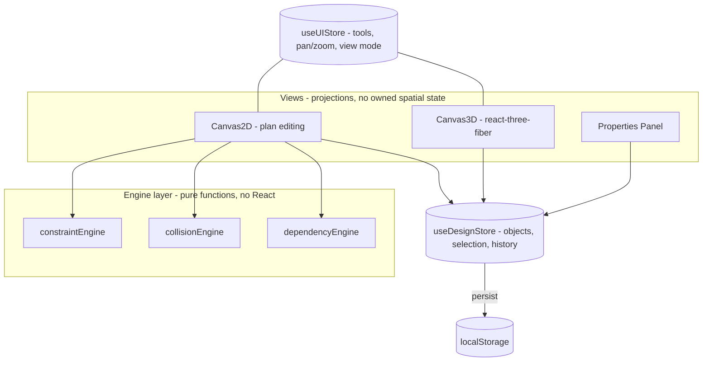

# Architecture

Home3D is a browser-based floor-plan editor with a synchronized 3D view.
This document explains the boundaries, why they exist, and how the design
evolves under scale. Decision records live in `docs/adr/`.

## System overview

## Boundaries and why they exist

- **Views own nothing.** Both canvases are projections of one design store. This
  is what makes 2D/3D sync a non-problem instead of a bug class.
- **Engines are pure.** Constraint, collision, and dependency logic take plain
  data and return plain data. They can be unit-tested, profiled, and replaced
  (e.g. with a spatial index) without touching React.
- **UI state is quarantined.** Pan/zoom/tool state changes at high frequency and
  must never invalidate design-data subscribers.

## The maturity curve (worked example: collision detection)

How the same problem is solved at increasing levels of engineering judgment:

1. **Junior** - check every pair every frame. Correct, O(n^2) per frame, dies at ~500 objects.
2. **Mid** - AABB sweep with exclusions, computed per drag event, not per frame. This is where Home3D is today: O(n) per pointer move - the right call at hundreds of objects.
3. **Senior** - spatial index (quadtree) behind the same engine API. O(log n) queries, invisible to callers. Justified only when scenes exceed ~10K objects.
4. **Staff** - one shared spatial index serving collision, constraint snapping, and selection picking, updated incrementally on mutation. Three O(n) scans collapse into one structure - a cross-cutting leverage decision.
5. **Principal** - question whether we should own it: reuse a physics broadphase (e.g. rapier), or choose the structure the future collaboration layer can also consume. Build vs buy vs align.

Each step up is not more cleverness - it is wider blast radius awareness.

## Scale evolution

| Stage | What changes | What breaks first if we skip it |
|---|---|---|
| V1 (today) | Local-first editor, localStorage | - |
| V2 | Accounts + design-document service (Postgres JSONB, versioned) | silent data loss, single-device lock-in |
| V3 | Asset/catalog service on CDN; lazy-loaded 3D route | bundle size throttles acquisition |
| 100K users | Observability (errors, perf telemetry); the team splits into module owners | the team, on Canvas2D.jsx - org failure precedes technical failure |
| 1M users | Spatial index, instanced 3D rendering, web workers for engines | pointer-move latency in power-user scenes |
| 10M users | editor-core as a platform: plugin API, headless engine package | competitors ship integrations we cannot |

## What survives every stage

The engine layer. Pure functions with no framework coupling are the only code
expected to pass through every redesign unmodified.

## Known structural debt

- `Canvas2D.jsx` concentrates tools, rendering, and events in one file (decomposition planned - see docs/code-reviews/)
- Object model is implicit (untyped); a schema/registry is the exit from `switch (subType)` growth
- Constraint thresholds are tuned for mouse input; touch requires rethinking
