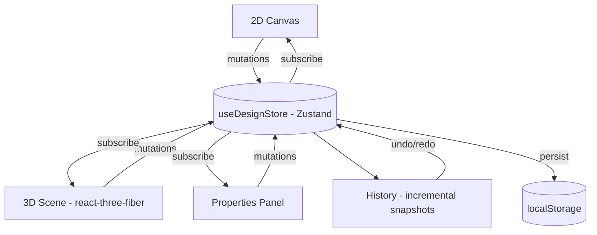

# Home3D — Open-Source 3D Home Designer

Design a home in 2D. Walk through it in 3D. Same data, zero desync.

Home3D is an open-source floor-plan editor and 3D visualizer that runs entirely in the browser — built with React, Three.js, and a single Zustand store as the source of truth.

## Features

- 2D floor-plan editor: snap-to-grid (20px), wall drawing with visual snap guides, drag-and-drop furniture placement
- Live 3D viewport: real-time sync from the 2D plan, with lighting, soft shadows, and ambient occlusion
- Direct 3D manipulation: select and drag objects in the 3D scene without losing camera position
- Undo/redo across both views via incremental state snapshots
- Designs persist across refreshes via local storage

## Architecture

Neither view owns the data. Both are projections of one store.



### Engineering decisions

- One store, two projections: every mutation goes through useDesignStore, so the 2D and 3D views cannot desync.
- Pointer-event isolation: interaction handles capture events before camera controls see them, so dragging an object and orbiting the camera never fight over the mouse.
- Snapshot-based undo/redo: simpler than a command pattern, and memory-cheap at floor-plan scale.

## Getting started

```bash
git clone https://github.com/lohith9/Home_View.git
cd Home_View/frontend
npm install
npm run dev
```

Open http://localhost:5173 in your browser. Requires Node 18+.

**Stack:** React 18 · Vite · Zustand · Three.js · @react-three/fiber · @react-three/drei · Tailwind CSS

## Known limitations

- No automated tests yet — the next engineering priority before new features
- Single-floor designs only
- Fixed furniture catalog; custom model import is on the roadmap

## Roadmap

- [ ] Test coverage and CI (GitHub Actions)
- [ ] Export designs to GLTF/OBJ
- [ ] Custom 3D model import
- [ ] Room auto-furnishing
- [ ] Real-time collaboration

## Contributing

Issues and PRs welcome — the roadmap above is a good place to start.

## License

MIT
