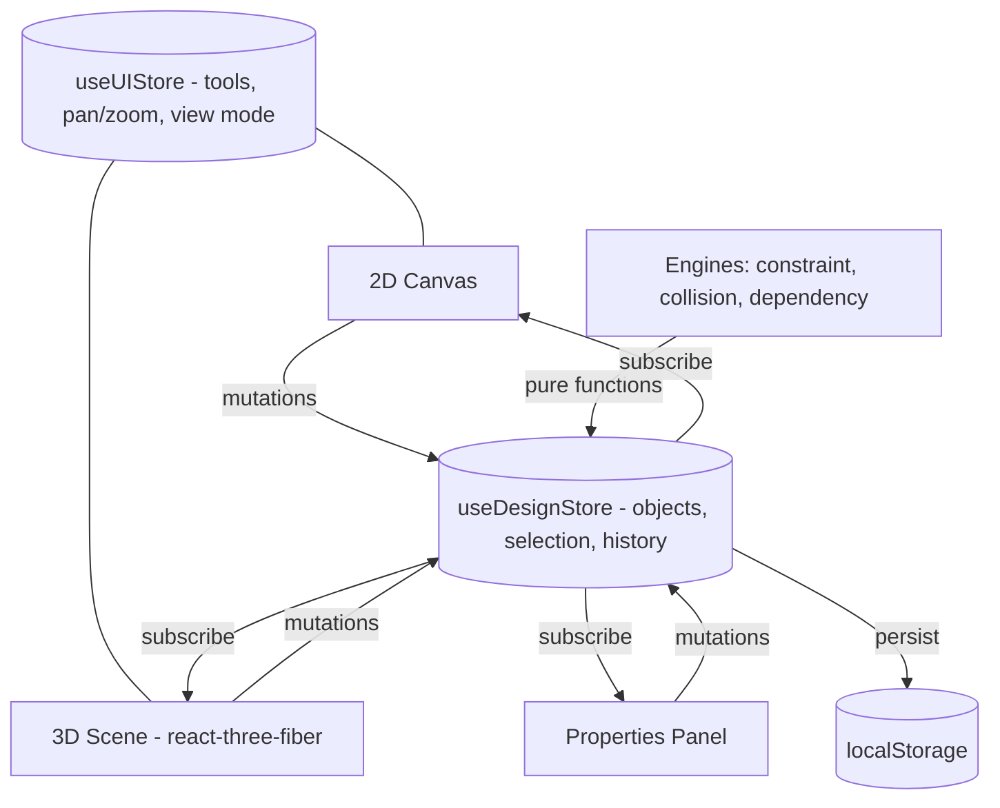

# Home3D — Open-Source 3D Home Designer

Design a home in 2D. Walk through it in 3D. Same data, zero desync.

Home3D is an open-source floor-plan editor and 3D visualizer that runs entirely in the browser — built with React, Three.js, and Zustand.

## Features

- 2D floor-plan editor: snap-to-grid wall drawing with visual snap guides, drag-and-drop furniture placement
- Constraint engine: doors and windows auto-attach to walls, wall endpoints corner-snap, edges align — every candidate scored by distance and priority
- Collision engine: AABB overlap detection with push-out resolution, so furniture never stacks
- Parametric dependencies: move a wall and its attached doors and windows move with it
- Live 3D viewport: real-time sync from the 2D plan, direct drag manipulation in 3D without losing camera position
- Undo/redo across both views via bounded incremental snapshots
- Save/load designs via local storage

## Architecture

Spatial data lives in one design store. Both views are projections of it; UI state (tools, pan/zoom, view mode) is deliberately separated.



### Engineering decisions

- Pure-function engine layer: constraint resolution, collision detection, and dependency propagation live outside React in `src/engine/` — testable in isolation, no framework coupling.
- Priority-scored constraints: wall-attach beats corner-snap beats edge-align beats grid, each gated by distance thresholds — one resolver instead of a pile of if-statements.
- History pushed once per drag gesture, not per pointer move — undo undoes the whole drag.
- Pointer-event isolation in 3D: objects capture the pointer before OrbitControls sees it, so dragging and orbiting never fight.

## Getting started

```bash
git clone https://github.com/lohith9/Home_View.git
cd Home_View/frontend
npm install
npm run dev        # http://localhost:5173
```

Requires Node 18+.

## Testing

End-to-end tests run with Playwright against real pointer interactions:

```bash
npm run test:e2e   # headless
npm run test:ui    # interactive UI mode
```

Suites cover collision resolution, wall-dependency propagation, editor edge cases, and a full house-building flow. Unit tests for the engine layer are the next priority.

**Stack:** React 19 · Vite · Zustand · Three.js · @react-three/fiber · @react-three/drei · Playwright

## Known limitations

- Engine layer has E2E coverage but no unit tests yet
- No CI pipeline running the test suite on PRs yet (CodeQL only)
- Fixed furniture catalog; custom model import is on the roadmap

## Roadmap

- [ ] Unit tests for constraint/collision/dependency engines
- [ ] CI workflow running lint, build, and the Playwright suite
- [ ] Export designs to GLTF/OBJ
- [ ] Custom 3D model import
- [ ] Room auto-furnishing
- [ ] Real-time collaboration

## Contributing

Issues and PRs welcome — the roadmap above is a good place to start.
